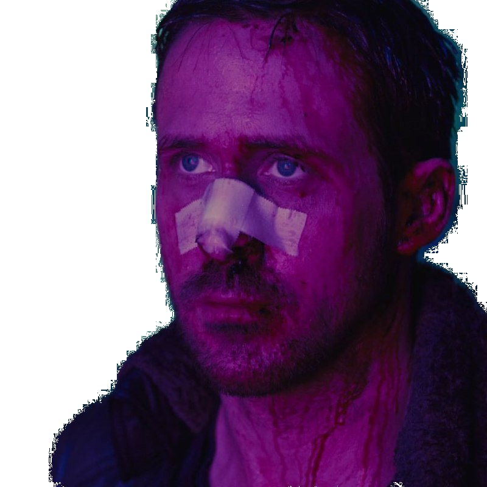

# BackgroundRemoverBot

2 ways to remove background using pure deep learning and its mixture with traditional methods

[Link to the telegram bot](https://t.me/simple_bg_remover_bot)

To work correctly, you need to add ```git clone https://github.com/shreyas-bk/U-2-Net``` to the project folder and *.pth* and *.h5* files with model weights in the models folder.

## Example of results:

### Original -> Pytorch model -> Tensorflow model

<p float="left">
  
  
   
</p>

<p float="left">
  
  
   
</p>

<p float="left">
  
  
   
</p>

### Example of a picture that models can't handle:

<p float="left">
  
  
   
</p>
